## 一、案例简介

### 1.1背景

家居智能化系统的概念起源于上世纪70年代的美国，随后，传播到欧洲、日本等国并且得到了很好的发展。在我国，智能家居这一概念推广较晚，约在90年代末家居智能化系统才得以进入国内，但发展速度惊人，至今已存在相当数量的智能化小区及住宅。

所谓智能家居是现代电子技术、自动化技术及通信技术相结合的产物。它能够自动控制和管理家电设备，对家庭环境的安全进行监控报警，并且能够为住户提供安全舒适、高效便利的学习生活及工作环境。与普通的家居相比，智能家居不仅具备传统的居住功能，提供舒适温馨，高效安全的高品位生活环境，还将一个被动静止的居住环境提升为一个有一定智慧协助能力的体贴的生活帮手，进一步优化住户的生活质量。

### 1.2概述

本次案例基于阿里物联网云以及Arduino的虚拟仿真平台，开发一个移动客户端的远程数据采集与控制应用，具体包括Android应用系统和微信小程序。可以实现简单的用户注册登录，可以在移动客户端和微信小程序对虚拟仿真平台进行开关灯控制，并且可以采集到仿真平台中空调的温湿度，在客户端显示，以及进行存储数据和查看历史数据等功能。

### 1.3意义

随着科技的提高，经济的发展，人们的物质生活水平的提高，对家居环境的要求也越来越高，作为家居智能化的核心部分—─智能家居控制系统也越发显得重要。家居智能化控制的开发和建设是未来国家、经济发展的必然趋势。智能家居控制器可以为系统提供智能控制方案，使住户的控制更便捷，更高效。而且在现在这个注重绿色环保的世界里，智能的为用户显示湿度、温度等。

## 二、案例原理

### 2.1阿里物联网云接入

#### 2.2.1物联网平台介绍

物联网云平台是为物联网定制的云平台，在物联网解决方案中，[物联网云平台](http://www.inodes.cn/device-cloud.html)有着举足轻重的作用。作为现代物联网系统的核心，物联网云平台向下连接海量设备，为设备提供安全可靠的连接通信能力，支撑设备数据采集上云；向上提供云端API，通过调用云端API将与应用端进行交互，实现远程控制。阿里物联网云是当前业界所推出各类物联网云的典型代表，运行稳定、易于开发，初学者可以免费使用，同时提供了丰富了增值能力。

产品与设备：云上定义的产品相当于一类设备的集合，同一产品下的设备具有相同的功能，比如可以根据产品批量管理设备。云上定义的设备对应于一个个实际的物联网设备，只要将物联网云颁发的设备证书(Productkey、DeviceName和DeviceSecret)关联到实际设备上，可实现实际设备接入物联网云平台。

设备功能：包括设备的属性，服务和事件。物联网平台通过定义TSL(Thing Specification Language)来描述物模型，这里TSL采用JSON格式。

（1）属性：设备的功能模型之一，一般用于描述设备运行时的状态，如环境监测设备所读取的当前环境温度等。属性支持GET和SET的请求方式，应用系统可发起对属性的读取和设置请求。

（2）产品标识符：阿里云采用产品标识符来指向具体功能(属性)，这里产品标识符其实就是云上的变量声明。

（3）Topic

物联网云采用发布订阅的方式，与实际设备之间进行数据交互；

Topic是UTF-8字符串，是发布(Pub)或订阅(Sub)消息的传输中介，设备可以向指定Topic发布或者订阅消息。

（4）设备证书（三元组）：设备证书指ProductKey、DeviceName、DeviceSecret。

l ProductKey：是物联网平台为产品颁发的全局唯一标识。该参数很重要，在设备认证以及通信中都会用到；

l DeviceName：在注册设备时，自定义的或自动生成的设备名称，具备产品维度内的唯一性；

l DeviceSecret：物联网平台为设备颁发的设备密钥，和DeviceName成对出现。

#### 2.2.2物联网平台准备

首先是创建物联网产品和设备，先注册一个阿里云账号，登录后进入控制台，左侧“产品与服务”列表中进入物联网平台，点击设备管理，创建产品，按照实验要求，我们需要建立一个产品，我命名产品名称为Samrt_Home，所属品类选择“自定义品类”，节点类型选择“直连设备”，连网方式选择“Wi-Fi”，数据格式选择“ICA标准数据格式”。 

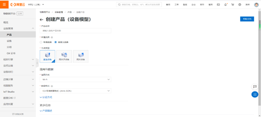

创建完产品后，设置产品标识符，产品页面点击“编辑草稿”设置产品标识符，点击“添加自定义功能”，功能类型选择“属性”，功能名称和标识符自定义，数据类型选择“text”，数据长度默认为2048字节，读写类型选择“读写”，建立了三个标识符，分别是light,temp和hum，编辑完成后发布上线。还需建立四个设备，Android客户端端，WeChat小程序，和虚拟平台对应的light和Temp_Hum,点击“添加设备”，输入DeviceName后完成创建。

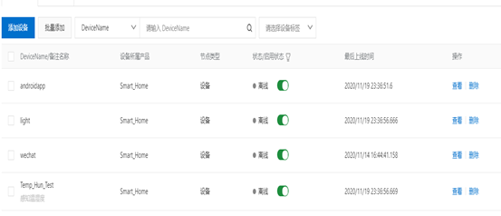

#### 2.1.3Android端接入阿里云

（1）创建一个新的Android工程。

（2）在gradle文件中，添加Paho Android Client依赖。本示例使用1.1.1版本的PahoAndroidClient，需添加以下依赖：

在工程build.gradle中，添加Paho仓库地址。本示例使用release仓库。

repositories {

  maven {

​    url "https://repo.eclipse.org/content/repositories/paho-releases/"

  }

}

在应用build.gradle中，添加Paho Android Service。本示例中，使用1.1.1 release版本的Paho服务，底层基于paho.client.mqttv3-1.1.0版本。

dependencies {

  implementation 'org.eclipse.paho:org.eclipse.paho.client.mqttv3:1.1.0'

  implementation 'org.eclipse.paho:org.eclipse.paho.android.service:1.1.1'

}

（3）为了使App能够绑定到Paho Android Service，需要在AndroidManifest.xml中添加以下信息：

声明以下服务：

```xml
<!-- Mqtt Service -->

<service android:name="org.eclipse.paho.android.service.MqttService">

</service>
```

添加Paho MQTT Service所需的权限。

```xml
<uses-permission android:name="android.permission.WAKE_LOCK" />

<uses-permission android:name="android.permission.ACCESS_NETWORK_STATE" />

<uses-permission android:name="android.permission.INTERNET" />

<uses-permission android:name="android.permission.READ_PHONE_STATE" />
```

（4）填写设备三元组并计算MQTT连接参数clientId、username和password。
String mqttclientId = clientId + "|securemode=3,signmethod=hmacsha1,timestamp=" + timestamp + "|";
            String mqttUsername = deviceName + "&" + productKey;
            String mqttPassword = AliyunIoTSignUtil.sign(params, deviceSecret, "hmacsha1");
(5)建立public Boolean connectMqtt(String url, String clientId, String mqttUsername, String mqttPassword) {}方法进行mqtt连接，如果返回值是true，连接成功。


（6）发布消息。封装publish方法，用于向Topic "/sys/" + productKey + "/" + deviceName + "/thing/event/property/post"发布指定payload的消息。

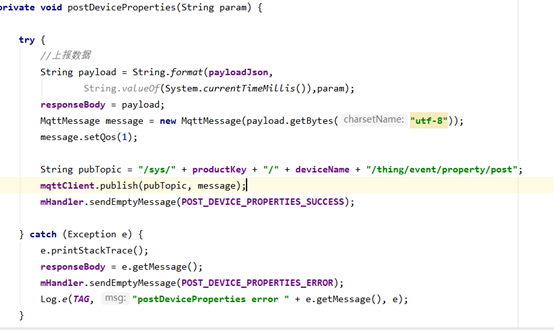

（7）封装subscribe方法，用于实现订阅 "/sys/" + productKey + "/" + deviceName + "/thing/service/property/set"，获取云端下发的消息。

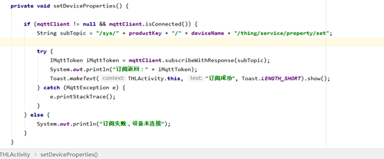

（8）云产品流转规则

Android客户端要想对虚拟平台的灯进行控制和接收到温湿度，要通过阿里云，Android将消息传给云，应该经过规则引擎云产品流转，然后云再传给虚拟平台，这样才能达到通信的效果。Android和虚拟平台通信需要建立两个转换规则，一个是light1，一个是Temp_Hum1。Temp_Hum1规则处理数据是物模型上报将虚拟平台发送的数据通过SELECT items FROM "/a135fL9Qn8Z/Temp_Hun_Test/thing/event/property/post"处理，转发数据是下发将数据发布到另一个Topic中：/sys/a135fL9Qn8Z/androidapp/thing/service/property/set，让Android客户端接收到数据。

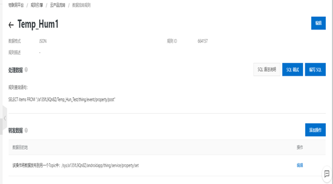

Light1规则处理数据是物模型上报，将Android客户端发送的信息通过数据库语句SELECT items.light.value as light FROM "/a135fL9Qn8Z/androidapp/thing/event/property/post"处理，然后转发数据将数据发布到另一个Topic中：/sys/a135fL9Qn8Z/light/thing/service/property/set，让虚拟平台接收数据。

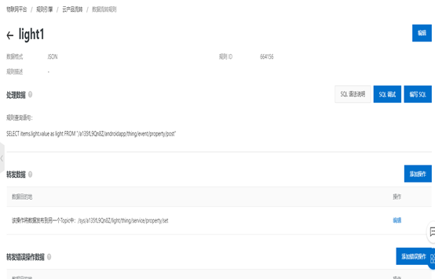

### 2.2虚拟平台

#### 2.2.1虚拟平台介绍

本平台主要提供了Arduino访问阿里物联网云的虚拟实验，并通过一个智能家居卧室场景，展示如何创建物联网节点、如何实现云与节点之间的交互。

该智能家居卧室虚拟场景，提供了空调、台灯以及路由器（WiFi）等设备，Arduino设备可连接温湿度传感器和数字继电器模块。

#### 2.2.2控制灯光操作

（1）创建虚拟场景

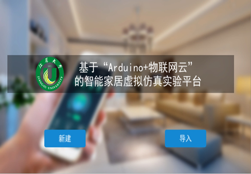

点击“新建”创建新场景。

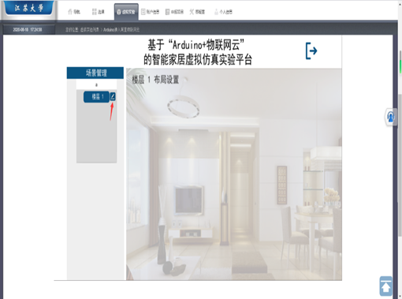

点击左侧图标创建仿真环境。

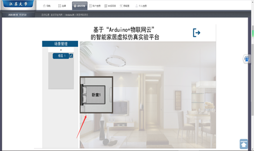

双击图标后进入场景配置界面。

（2）添加ESP32开发板

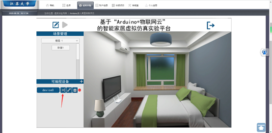

点击左侧按钮配置开发板，选择ESP32开发板。

（3）连接传感器

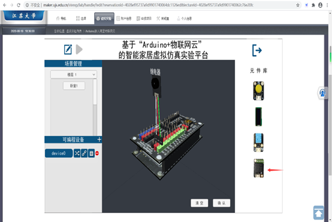

将右侧元件库中的数字继电器拖入，并连接在ESP32开发板数字接口D1上。

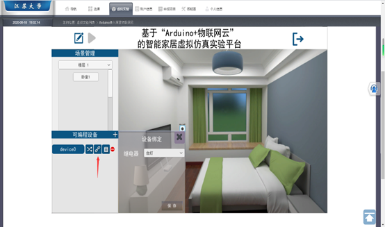

配置完成后将设备拖入场景中，点击左侧按钮绑定设备。

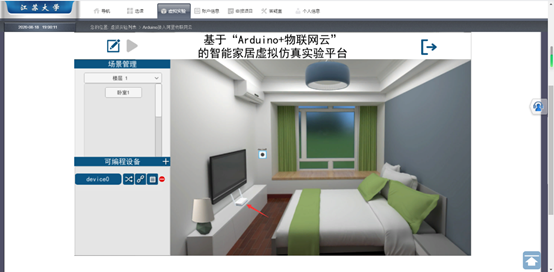

点击路由器设置WiFi的SSID和PWD，自定义即可。


点击左侧按钮进入Arduino在线编译系统。

（4）Arduino在线编译

   进入arduino编译系统后，可以看到平台已经给了具体的代码，我们只需按照指导文档对空缺处进行添加即可，先填写我们连接继电器时对应的数字接口，配置WiFi名和密码，配置设备证书信息，这个我们打开阿里云物联网平台，从我们创建的设备里可以查看，然后配置域名和端口号，要和物联网云平台的一致，填写产品标识符，标识符在建立的产品里的功能定义里查看，接着填写上报和订阅的两个TOPIC，这里采用的是物模型通信Topic格式，在物联网平台可以查看。最后补充一些控制语句就完成了，编辑后选择32开发板点击上传，等待程序编译，编译成功后返回仿真平台页面，点击左侧按钮运行，打开阿里云云平台，可以看到与之对应的设备已在线，在线调试也可成功控制开关灯。

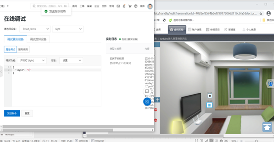

#### 2.2.3感知温湿度

这个部分内容和控制开关灯类似，只需在新建好的虚拟场景里添加设备，然后选择ESP32板，点击左侧导航栏第一个控件，进入图示界面，拖拽温湿度传感器到中部界面，点击传感器与ESP32板上的数字引脚，即可完成连接。将左侧导航栏红框部分向虚拟场景拖拽，在虚拟场景内部署温湿度传感器，完成后进入Arduino在线编译系统进行补充代码，对照指导文档和物联网平台建立对应的设备进行填写，具体操作与控制开关灯部分相同。编译成功后，点击运行，然后可以在物联网平台看到相应设备已激活在线，点击物模型数据，可以看到温湿度能正确显示，数据传输成功。

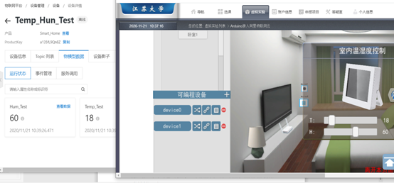

## 三、需求分析

### 3.1业务需求

实现家居智能化，使住户的控制更便捷，更高效。

### 3.2用户需求

用户可以进行简单注册登录，开关灯控制，查看温湿度，查看历史温湿度，

### 3.3功能需求

#### 3.3.1注册登录

用户可以进行注册，注册后的用户名和密码应该插入到数据库里，在登录的时候进行查询，如果输入的账号密码在数据库中，则登录成功，界面跳转到采集和控制功能界面。

#### 3.3.2开关灯控制和温湿度显示

通过mqtt协议接入阿里云，post和set发布和接收消息，通过阿里云流转，用户在Android客户端能对开关灯进行控制，并且温湿度可以在客户端显示，实时更新。

#### 3.3.3数据存储和历史数据显示

客户端每次会将收到的温湿度进行xml存储里，并且查询历史数据时通过listview将每次的温湿度进行显示。

## 四、项目设计

### 4.1界面设计

#### 4.1.1登录注册界面

两个xml文件，首先进入app的是界面是登录界面，若用户已注册，进行登录则跳转到数据显示界面，若用户未注册，点击注册按钮则跳转到注册界面，用户可以输入用户名和密码进行注册。

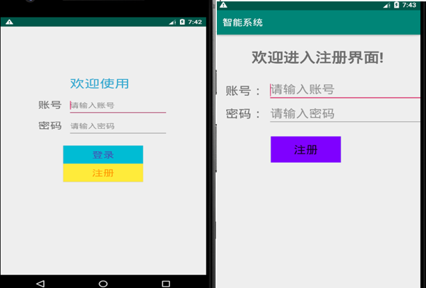

#### 4.1.2数据显示界面

一个xml文件，用两个文本框显示传输过来的温湿度，还有三个按钮，开关灯和显示历史数据，分别用于控制灯的开关和查看历史传输过来的温湿度。

#### 4.1.3历史数据显示界面

 一个xml文件，通过Listview来显示之前不同时间传输过来的温湿度。

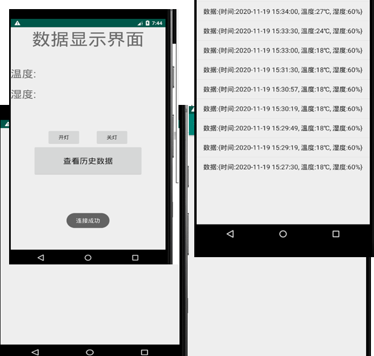

### 4.2数据库设计

数据库用与存储用户注册信息，先建立数据库，建立用户表，每次用户注册后，将number和password插入数据库，进行存储，登录时查询数据库，如果数据存在，登录成功，否则提示用户名或密码错误。

### 4.3功能设计

#### 4.3.1注册登录功能

在layout里写两个xml文件，用于注册和登录界面，先进入的是登录界面，可以选择登录还是注册。

#### 4.3.2连接阿里云

此模块Android通过mqtt连接阿里云，并订阅和发布信息。

#### 4.3.3开关灯

用户点击开关灯按钮对虚拟平台里的灯进行开关控制，通过post发布数据到阿里云，经过云流转，数据传递给虚拟平台，控制灯开关。

#### 4.3.4温湿度显示

Android客户端接收到温湿度，并显示在数据显示界面，通过订阅Topic，mqtt回调，接收到云平台传过来的数据，再进行JSON解析，提取到我们需要的温湿度，通过setText进行显示。

#### 4.3.5xml解析和xml存储

   JSON解析出温湿度时并获取时间，对其进行xml序列化，有父节点，时间和温湿度部分。序列化后进行解析，存入集合，在查看历史数据时将解析出的数据通过一个列表显示在界面上。

## 五、实现与测试

### 5.1注册与登录

设置按钮添加监听，注册和登录按钮，若点击登录按钮，执行login.setOnClickListener(new View.OnClickListener() {}），通过getText().toString获取用户输入的用户名和密码，此时调用uService。Login(number,password)方法，若返回值是true,代表登录信息在数据库中，先前已注册，执行Toast.makeText(LoginActivity.this, "登录成功", Toast.LENGTH_LONG).show();通过Intent intent = new Intent(LoginActivity.this, ThlActivity.class); startActivity(intent);跳转到数据显示页面，否则弹出“登录失败，用户名或密码不正确”。若点击注册按钮，执行register.setOnClickListener(new View.OnClickListener() {}）部分，通过Intent语句，跳转到注册界面，输入用户名和密码进行注册，建立user，通过uService.register(user);存入数据库。

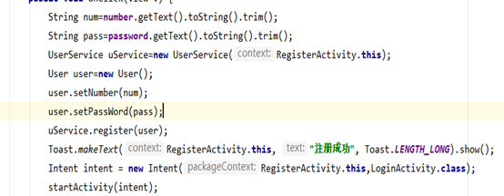

### 5.2数据库设计

先建立类DatabaseHelper，继承于并SQLiteOpenHelper，创建数据库， String sql="create table user(id integer primary key autoincrement,number varchar(20),password varchar(20))"; db.execSQL(sql);，创建一个user表，用于注册信息存储。建立userservice类进行登录时对数据库进行查询，判断是否存在，注册时插入信息。登录时调用方法login(number,password), String sql="select * from user where number=? and password=?";Cursor cursor=sdb.rawQuery(sql, new String[]{number,password});判断是否在数据库，在的话返回值为true,在登录那里通过if语句判断是否能登录成功。

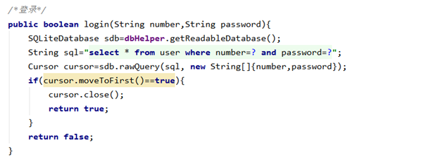

注册时将注册信息插入数据库。

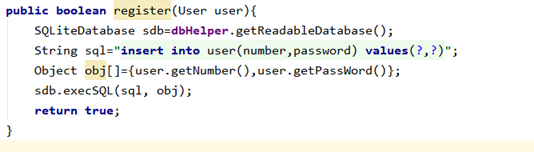

### 5.3控制开关灯

点击开灯按钮，开灯参数parms为1，调用post发送函数，上报数据，mqttClient.publish(pubTopic, message);发送数据到云平台，经过规则引擎云流转，云平台将{“light”：“1”}发送给虚拟平台，虚拟平台灯变亮。同理，点击关灯按钮，parms则为0，post发送数据。

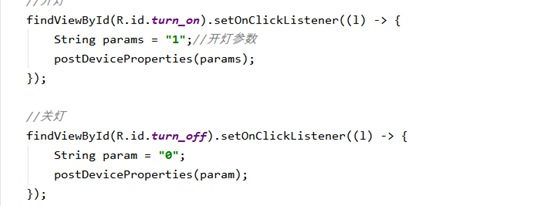

### 5.4显示温湿度

Android客户端先订阅topic,mqtt回调，接收到云平台传过来的数据，然后进行JSON解析，JsonData.substring(47,49);提取出湿度，JsonData.substring(90，92);提取温度，然后将温湿度显示。

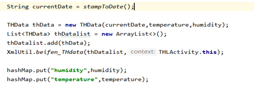

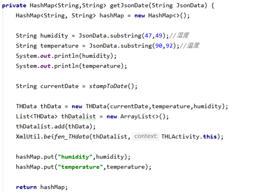

### 5.5xml存储和xml解析

每次进行JSON解析时，调用THData(currentDate,temperature,humidity);方法，new ArrayList<>();然后将thData存入，调用XmlUtil.beifen_THdata(thDatalist,THLActivity.this);

如果xml文件存在且不为空，则先解析xml，存入集合，再将两个集合合并再写入文件，进行存储温湿度信息，若文件不存在，直接写入。

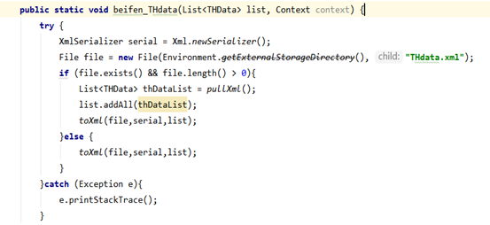

xml序列化，创建一个xml文件的序列化器，返回一个Xml的 Serializer 对象，XmlSerializer serial = Xml.*newSerializer*();设置序列化器的输出路径和编码方式，fi_out = new FileOutputStream(file); serial.setOutput(fi_out, "utf-8");声明xml文件头(写入XML文件中的声明头)，serial.startDocument("utf-8", true);声明父节点，再声明节点属性，声明节点中的TextNode，设置节点尾标签，写Xml文件尾表示Xml文件结束， serial.endDocument();关闭资源 fi_out.close()。

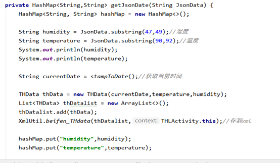

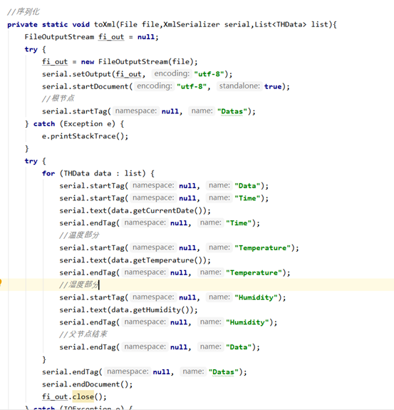

Xml解析，当点击显示历史数据按钮时，要对刚才存储的xml进行解析，存储时也要对先前的xml文件进行解析以便更新，采用pull方式进行。通过XMLPullParserFactory获取XMLPullParser对象，通过XMLPullParser对象设置输入流，setInput(new StringReader(xml字符串))得到你想要解析的xml字符串，进行循环解析XML文件直到文件的尾部。

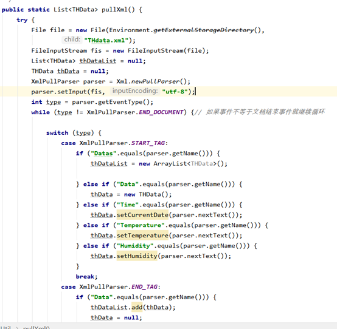

点击显示查看历史数据按钮，先创建一个listview，然后将存储的xml文件进行解析，装进集合，创建一个ArrayAdapter，将解析的xml放入，然后设置列表到显示界面进行显示。

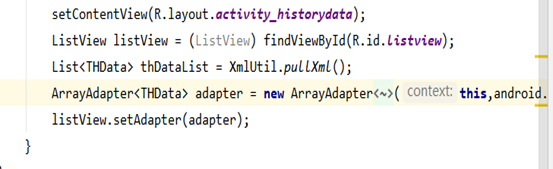

### 5.6实验结果

在安卓客户端点击开灯按钮，可以看到虚拟平台的灯变亮，结果正确。

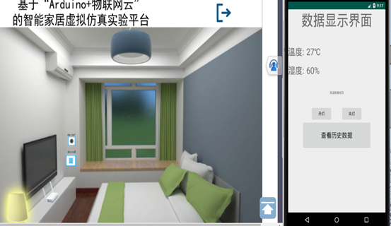

在安卓客户端点击关灯按钮，可以看到虚拟平台的灯熄灭，结果正确。

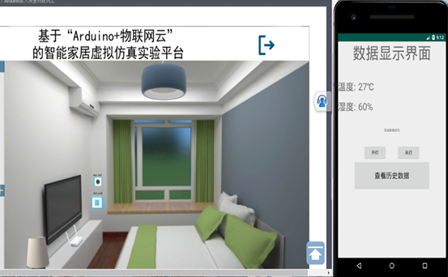

在安卓客户端可以看到接收到的温湿度和虚拟平台空调的温湿度一致，传输正确。

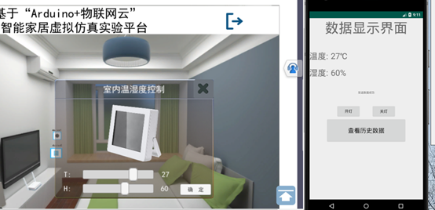

在Android studio点击view里的Device File Explorer,点击sdcard下Ringtones可以看到有一个THdata.xml文件，里面存储的是传输到Android客户端的温湿度。

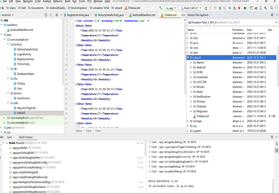

## 六、总结

经过一学期的短暂学习，我了解了Android开发，学习了基础操作并进行了几次简单的课程实践，本次大作业是基于阿里物联网云以及Arduino的虚拟仿真平台，开发一个移动客户端的远程数据采集与控制应用。

这个作业对我来说还是有很大难度的，Android刚学完，基础操作应该没问题，阿里云里的物联网平台第一次使用，刚开始就在这里卡了很久，不知道如何将Android接入阿里云平台。后来选择先把小程序客户端做好，这个就很简单了，虚拟平台那里前一次实验课上基本已经部署好了，可以在物联网平台上进行在线调试成功，小程序源码给了，只需进行修改即可。小程序一开始不可以，点上线按钮直接报错，后来舍友告诉我文档给的一个js文件本身有问题，然后在网上找了一个mqtt.js添加进去，重新编译发现可以接入阿里云了，设备那里已在线，然后就是建立云产品流转规则，一开始也不是很懂，先去看了阿里云提供的官方文档，再结合给的指导书就简单了，然后可以成功实现控制开关灯，显示温湿度，小程序要求不多，也给了源码，完成还是很简单的。

小程序的实践对实现Android客户端还是起了很大作用的，起码不是一头雾水了，知道了要使用mqtt协议接入阿里云，用发布/订阅消息模式来接受和转发数据，使用json作为数据交换格式，对传递的数据进行解析等等，还发现了阿里云提供了官方文档，里面具体讲解了Android如何接入阿里云，服务端订阅设备消息，设备接受云端指令，物模型，数据解析，云产品流转等等内容，感觉如获至宝，只是知道的晚了几天，不然之前就不会一筹莫展了，还是得多百度查找资源，请教别人。
看完官方文档后发现也不是很难了，根据给的一些模板直接套用，虽然里面的内容还不是很清楚，但是也学习到了一些内容。Android端能接入阿里云平台后开始写post和set，和微信小程序差不多，只是语法不同，官方文档也给了具体例子，可以套用进行修改和补充，遇到的问题百度也能解决，很快实现了开关灯控制，云产品流转语句和小程序一样，温湿度显示刚开始不可以，json解析没能提取出温湿度数据，在阿里云平台日志服务里可以看到虚拟平台把数据传到了云，云经过流转，可以传给Android，只是传过来的数据没能提取出temp和hum，后来发现可以使用JsonData.substring(47,49)来将温度提取出来，湿度类似，然后就解决了问题。Android客户端大致功能实现后就是细节了，也是之前几次实验的综合，例如使用数据库来存储查询数据，xml序列化和解析，adapter适配器的使用等等。
数据库使用在注册登录那里，每次注册时，将用户名和密码插入存储，登录时进行查询，如果在数据库中，则登录成功到功能界面，不在数据库中则登录失败，xml文件存储实现在温湿度的存储，每次接收到温湿度时，new THData(currentDate,temperature,humidity)，并且存入xml。显示历史数据时先解析xml,然后创建一个ArrayAdapter，将解析出的xml放上去，通过listview展示。
在本次大作业里我收获了很多，首先对半个多学习的Android学习进行综合实践，提高了自己的动手能力和思考能力，加深了对Android基础的认识，还学习了阿里云物联网平台的使用、mqtt协议内容和arduino的一些知识，拓宽了自己的知识面，学习到了一些新内容。虽然作业完成了，但是学习还得继续，Android学习还是很有趣的，课程只是教会一些基础知识，帮助我入门，想要真正做出一些东西，还是得继续努力，深入学习，增加自己的能力。
遇到的问题及解决办法
1、对mqtt协议和阿里云物联网平台不熟悉，Android客户端接入阿里云以及订阅发布消息不懂，参考官方文档，对照指导文档和例子进行学习。

2.本次作业综合前几次实验内容，有些地方已模糊不清，例如xml序列化和解析部分，重新看了PPT以及百度例子进行学习，然后结合到这次作业。

[代码地址](https://github.com/wyljyllz/android)

## 参考文献

【1】https://help.aliyun.com/document_detail/146630.html?spm=a2c4g.11186623.6.950.7d715ca66PBrjf [OL]

【2】https://help.aliyun.com/document_detail/73705.html?spm=a2c4g.11174283.2.12.1dc71668rfFmbj [OL]

【3】https://help.aliyun.com/document_detail/42733.html?spm=a2c4g.11174283.2.25.1dc71668rfFmbj[OL]

【4】https://help.aliyun.com/document_detail/30554.html?spm=a2c4g.11174283.2.26.1dc71668rfFmbj [OL]

【5】https://help.aliyun.com/document_detail/68702.html?spm=a2c4g.11174283.2.21.1dc71668rfFmbj [OL]

【6】https://help.aliyun.com/document_detail/44542.html?spm=a2c4g.11174283.2.32.1dc71668rfFmbj [OL]